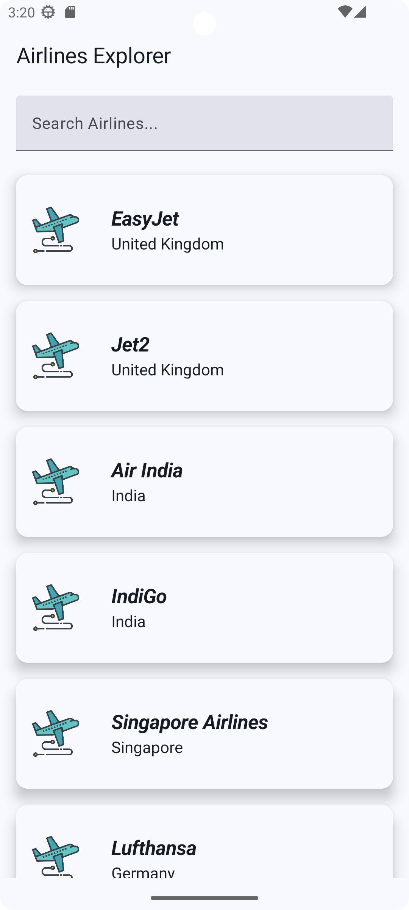
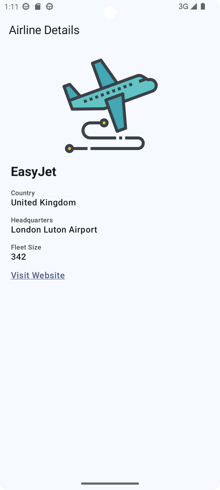

# ✈️ Airline Explorer

An Android app built with Jetpack Compose to explore airlines and view detailed information including country, headquarters, fleet size, and website.

---

## 📱 Screenshots

<table>
  <tr>
    <th>🧾 Airline List Screen</th>
    <th>🛬 Airline Detail Screen</th>
  </tr>
  <tr>
    <td align="center">
      
    </td>
    <td align="center">
      
    </td>
  </tr>
</table>


---

## 📄 Features

- ✅ View airlines in a scrollable list
- ✅ Search airlines by name or country
- ✅ See details like headquarters, fleet size, and website
- ✅ Static image fallback for logos
- ✅ Local JSON source (`airlines.json`)
- ✅ MVVM + Flow-based architecture
- ✅ Retrofit setup included for future API integration
- ✅ Modern UI using Jetpack Compose (Material 3)

---

## 🛠 Tech Stack

| Layer         | Technology                   |
|---------------|-------------------------------|
| Language      | Kotlin                        |
| UI            | Jetpack Compose (Material3)   |
| Architecture  | MVVM + Flow                   |
| Async         | Kotlin Coroutines + Flow      |
| JSON Parsing  | Gson                          |
| Networking    | Retrofit (configured, not used) |
| Image Loader  | Coil (for remote/logo images) |
| Testing       | JUnit + MockK + Compose Test  |
| DI Ready      | Hilt-ready (DI modules setup) |

---

## 🚀 Build & Run Instructions

### ✅ Prerequisites

| Tool             | Minimum Version     |
|------------------|----------------------|
| Android Studio   | Hedgehog (2023.1.1+) |
| Kotlin           | 1.9.22               |
| Gradle Plugin    | 8.2.1                |
| Android SDK      | API 24+ (minSdk)     |
| Compile SDK      | API 34 or above      |

---

### 🔧 Steps to Build & Run

1. **Clone the repository**
   ```bash
   git clone https://github.com/yourusername/airline-explorer.git
   cd airline-explorer

2. **Open in Android Studio**
   - Launch **Android Studio**
   - Click **File > Open**
   - Select the cloned `airline-explorer` folder
   - Wait for **Gradle sync** to finish (you'll see progress at the bottom)

3. **Build the project**
   - Go to **Build > Rebuild Project**
   - This ensures all dependencies and generated files are in place

4. **Run the app**
   - Start an emulator (API 24 or higher) or connect a real device
   - Click **Run > Run 'app'** or press `Shift + F10`

5. **Run tests**
   - ✅ Unit tests:
     ```bash
     ./gradlew testDebugUnitTest
     ```

---

## ❗ Challenges Faced

- 🔄 No API server available — app uses static JSON from the `assets` folder as a data source
- 🖼 Remote airline logo URLs were not reliable — so local fallback images were used
- 🔍 Search is done entirely on the client-side using in-memory filtering
- 💾 No caching layer (Room/SharedPrefs) implemented since real-time data wasn’t present

---

## 🚧 Future Improvements (If API Server is Available)

- 🌐 **Live API Integration** using Retrofit for real-time airline data
- 💾 **Local caching** via Room or DataStore for offline support and persistence
- ⭐ **Favorite Airlines** feature using persistent storage (like Room)
- 🔄 **Pagination or lazy loading** from server to improve performance on large datasets
- ❌ **Error/retry handling** for failed network requests
- ✅ More **Compose UI tests** including scroll, click, and navigation assertions
